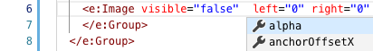
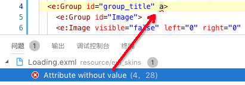
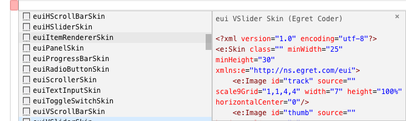
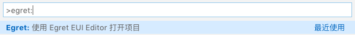
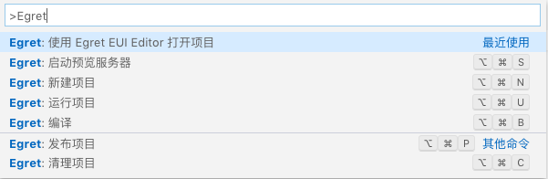
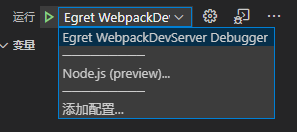
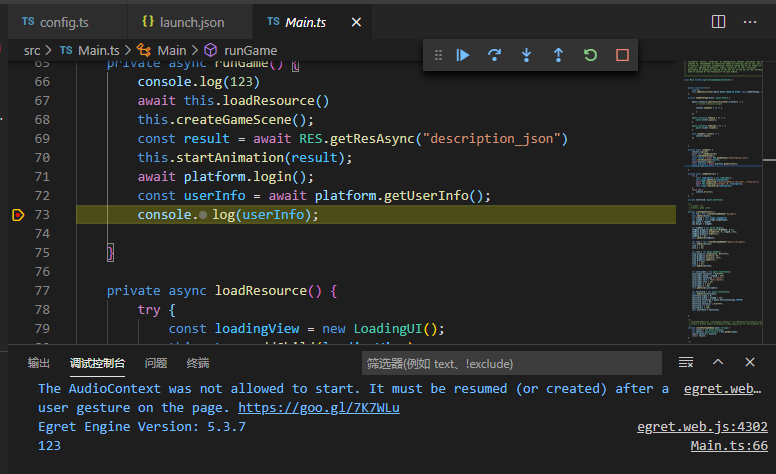
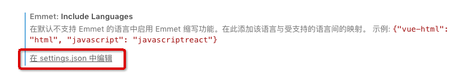

# **Egret Extension for Visual Studio Code**


使用 Visual Studio Code 开发白鹭项目

---

## 主要功能

* `exml` 文件代码编辑功能

  * 语法高亮
  * 自动完成

    

  * 错误提示功能

    

  * 常用的代码片段

    

  * 代码格式化功能

* 与 `Egret UI Editor` 的配合

  调用 `Egret UI Editor` 打开白鹭项目

* 调用白鹭引擎命令

  调用白鹭引擎的编译 / 清理 / 创建项目等功能

* 调试功能

  运行并调试白鹭项目

---

## 使用方法

* 激活插件

  此插件只有在以下情况才会激活:

  * Visual Studio Code 当前窗口打开了文件夹
  * 文件夹中包含白鹭项目的 `egretProperties.json` 文件

  激活完成后窗口右下角状态栏会出现四个按钮 (依次代表 "启动调试服务器", "编译", "清理", "创建新项目" 功能)

  

* 调用 `Egret UI Editor` 打开项目目录

  在 主菜单 > 查看 > 命令面板 > 选择下图的命令

  

* 调用白鹭引擎命令

  在 主菜单 > 查看 > 命令面板 > 选择下图的命令

  

  或者点击状态栏的对应按钮

* 调试功能

  * 在 Visual Studio Code 中打开你的白鹭项目文件夹。
  * 项目中会包含有`.vscode/Launch.json`和`.vscode/tasks.json`两个文件（已有的情况下增量修改，没有的情况下自动创建）。里面分别有`Egret WebpackDevServer Debugger`和`egret: build`的配置。
  * 确保`./scripts/config.ts`中`build`命令的配置符合如下内容。其中端口号默认为3000，应当与`.vscode/Launch.json`中`Egret WebpackDevServer Debugger`url地址末尾的端口号一致

  ```typescript
  const outputDir = '.';
            return {
                outputDir,
                commands: [
                    new ExmlPlugin('debug'), // 非 EUI 项目关闭此设置
                    new WebpackDevServerPlugin({ //新的 Webpack 编译器
                        libraryType: "debug",
                        defines: { DEBUG: true, RELEASE: false },
                        typescript: { mode: 'legacy' },
                        // open: true,
                        port: 3000
                    }),
                ]
            }
  ```

* 
  * 在运行面板的列表中选择 `Egret WebpackDevServer Debugger`

  

  * 点击开始调试按钮
  * 如果调试启动成功, 会弹出谷歌浏览器环境下白鹭项目的运行页面, 并开始调试过程
  * 可以在Vscode中进行断点调试。同时浏览器控制台的输出信息会同步显示在调试控制台中

    


* 在 `exml` 文件编辑中打开 `emmet` 支持

  进入到 Vscode 的设置界面, 查找 `Emmet: includeLanguages` 这个设置项, 点击它对应的 在 setting.json 中编辑的连接

  

  在打开的右侧编辑区添加以下设置内容: (表示以 xml 的方式使用 Emmet)

  ```json
  "emmet.includeLanguages": {
    "exml": "xml"
  }
  ```

